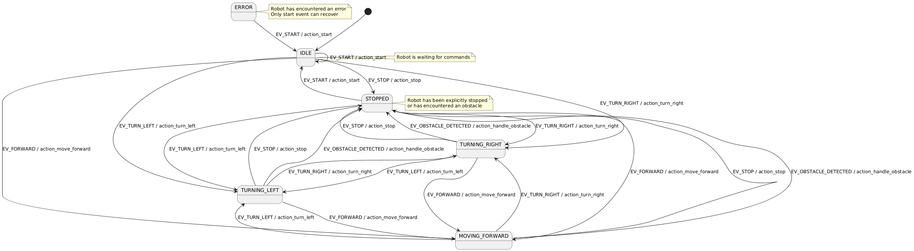

# Robot Controller

## Simulateur utilisé

Notre projet est fonctionnel sur le **simulateur 2D**.

## Compilation du projet

Pour compiler le projet :

```bash
cd src/
make clean
make
```

**Note importante :** Dans le Makefile, la librairie mrpiz est configurée par défaut pour l'architecture ARM. Si vous utilisez un ordinateur en architecture x64, vous devrez modifier le Makefile pour utiliser la version x64 de la librairie.

## Lancement du programme

Le lancement complet du système nécessite trois terminaux différents :

### Terminal 1 : Simulateur robot

Se placer dans le dossier parent du projet et lancez le simulateur :

```bash
# Si vous êtes dans le dossier Mission_C_Avance/
cd ..
java -jar intox_v0.9-mrpiz_v0.5-java_11.jar
```

### Terminal 2 : Serveur

Accéder au dossier bin et lancer le serveur :

```bash
cd bin/
./serveur
```

Le serveur attend une connexion client sur le port 12346.

### Terminal 3 : Client

Accéder au dossier bin et lancer le client en spécifiant l'adresse IP du serveur :

```bash
cd bin/
./client 127.0.0.1
```

### Commandes réalisables par le client

- Z : Avancer
- Q : Tourner à gauche
- D : Tourner à droite
- S : Arrêter
- Échap : Quitter

## Vue d'ensemble du projet

Ce projet implémente un système de contrôle de robot avec une architecture client-serveur et une machine à états pour gérer le comportement du robot. Le système permet de contrôler le robot en utilisant un mode manuel (via un client).

## Organisation des fichiers

### Fichiers principaux (src/)

- **main.c** : Programme principal pour le mode autonome
- **serveur.c** : Implémentation du serveur pour le contrôle à distance
- **client.c** : Implémentation du client pour contrôler le robot à distance
- **utils.h** : Utilitaires de débogage et de trace

### Fichiers de la bibliothèque robot_app (src/robot_app/)

- **robot.h/robot.c** : Interface bas niveau avec le matériel du robot
- **robot_state.h/robot_state.c** : Implémentation de la machine à états
- **robot_comm.h** : Définition des structures de communication client-serveur
- **pilot.h/pilot.c** : Gestion des déplacements du robot
- **copilot.h/copilot.c** : Gestion des chemins et des entrées utilisateur
- **client.h/client.c** : Structure pour la gestion des clients (différent du client.c principal)

## Composants principaux

### Serveur (serveur.c)

- Gère la connexion avec les clients
- Communique l'état du robot aux clients
- Reçoit les commandes des clients et les transmet au robot
- Gère les événements tels que la détection d'obstacles et le niveau de batterie

### Client (client.c)

- Interface utilisateur pour contrôler le robot à distance
- Affiche l'état actuel du robot (capteurs, batterie, etc.)
- Permet de commander le robot via les touches du clavier (Z, Q, D, S)

### Machine à États (robot_state.c)

- Modélise les différents états du robot : IDLE, MOVING_FORWARD, TURNING_LEFT, TURNING_RIGHT, STOPPED, ERROR
- Gère les transitions entre les états en fonction des événements
- Exécute les actions associées aux transitions

### Pilote (pilot.c)

- Contrôle les mouvements de base du robot
- Gère les déplacements vers l'avant et les rotations
- Détecte les obstacles et arrête le robot en cas de besoin

### Copilote (copilot.c)

- Gère des séquences de mouvements (chemins)
- Implémente l'évitement d'obstacles
- Traite les entrées utilisateur en mode manuel

## Fonctionnalités de sécurité

- Détection d'obstacles : Le robot s'arrête automatiquement lorsqu'un obstacle est détecté
- Surveillance de la batterie : Une alerte est émise lorsque le niveau de batterie est faible
- Signalisation par LED : Indique l'état du robot (vert pour normal, rouge pour obstacle, bleu pour problème)

## Machine à État

La gestion du comportement du robot est modélisée à l'aide d'une **machine à états** qui définit les différents états dans lesquels le robot peut se trouver et les transitions possibles entre ces états.

États principaux :

- IDLE : Robot en attente de commandes
- MOVING_FORWARD : Robot se déplaçant vers l'avant
- TURNING_LEFT : Robot tournant à gauche
- TURNING_RIGHT : Robot tournant à droite
- STOPPED : Robot arrêté explicitement ou après détection d'obstacle
- ERROR : État d'erreur (ex: batterie faible)

Voici la machine à état réalisée :



Si la machine à état ne s'affiche pas correctement, vous pouvez consulter le diagramme dans le fichier **MaE.png**.
